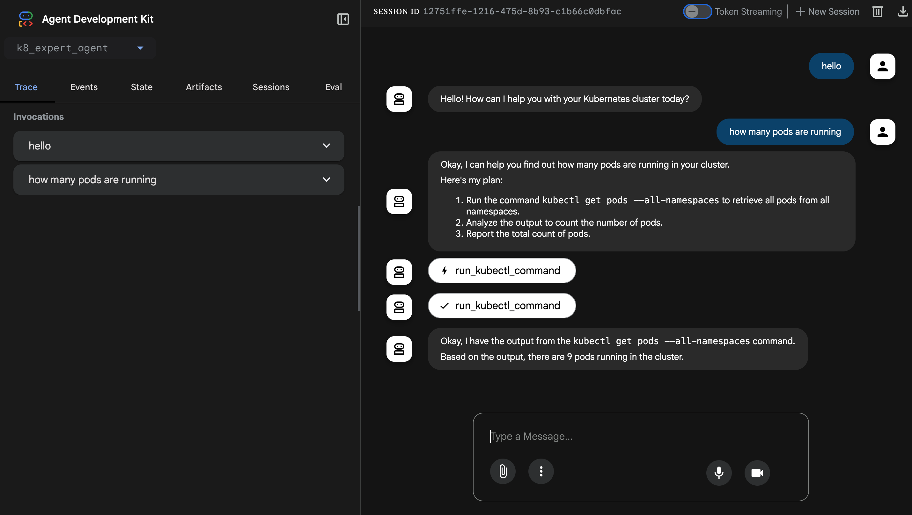

# k8-expert

Your AI-powered assistant for Kubernetes.



## Setup

1. **Create and activate the conda environment:**
   ```bash
   conda create -n k8-expert python=3.12 -y
   conda activate k8-expert
   ```

2. Install dependencies
   ```bash
   pip install .
   ```

3. Set up your environment variables
   ```bash
   cp k8_expert_agent/.env.example k8_expert_agent/.env
   ```

4. Run the Agent
   ```bash
   adk web
   ```